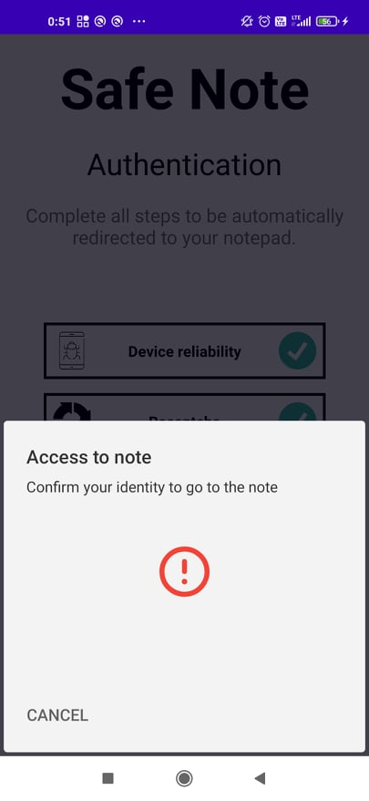
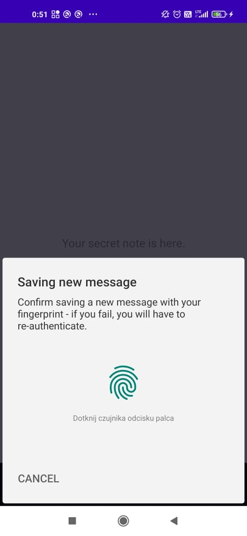
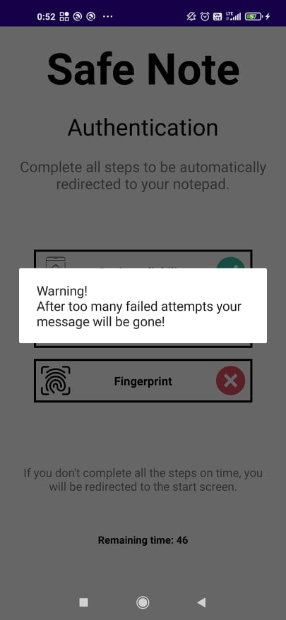
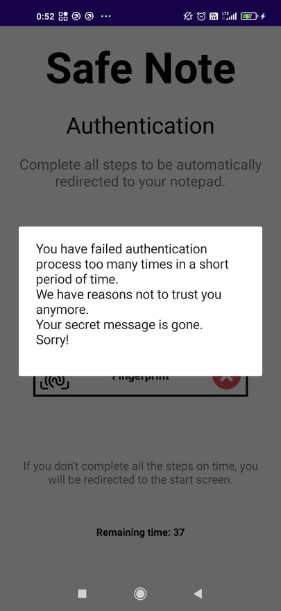
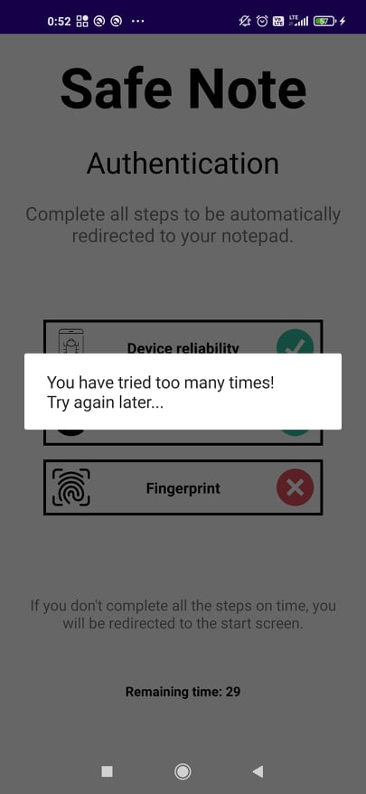
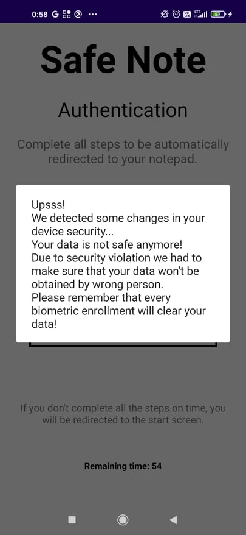

# Information about the project

#### Project name: Safe Note Fingerprint
#### Technologies: Kotlin
#### Creation time: Fifth semester of computer science studies
#### Purpose of creation: security of mobile systems classes
#### Author(s): Kajetan Gałęziowski 

# Preview and description

## Preview:







## Errors:










## Description:

#### Architecture: Model - View - ViewModel

#### KeyStore:
Considered secure as we cannot access key material. 
However, an attacker might not actually need the key contents. The Keystore API could be used to retrieve key references, then they could be used to initialize the Cipher object and then they could be used to decrypt or encrypt application storage.
That's why biometric authentication is crucial to use.
My implementation is per-operation key authorization. With usage of CryptoObject, key is used only two times, for decryption and encryption - only per operation, always with biometric authorization required to use key.

- setBlockModes(KeyProperties.BLOCK_MODE_GCM) cipher mode GCM
- setEncryptionPaddings(KeyProperties.ENCRYPTION_PADDING_NONE) no padding
- setKeySize(256)
- setIsStrongBoxBacked(true) - usage of StrongBox is available (secured hardware even more secured)
- setUnlockedDeviceRequired(true)
- setUserAuthenticationRequired(true)
- setInvalidatedByBiometricEnrollment(true) - remove data on enrollment
- setUserAuthenticationValidityDurationSeconds(-1) - only strong biometric authentication 

#### Implemented security:
- verification whether device is rooted or not (used koltin implementation https://github.com/scottyab/rootbeer)
- recaptcha verifcation
- limited time for authorization (timeout to main screen if count down finishes)
- app is not allowed to work in background (minimazing app = getting app closed)
- manual protection - you need to know how to display message in note screen
- message will be deleted if BiometricPrompt locks due to too many failed attempts
- message will be deleted on new biometric enrollment
- user has 5 chances in authorization process to decrypt message and look up - if fails message is gone
- user has 1 chance in authorization process to encrypt new message and replace old one - if fails, gets kicked and has to re-authenticate again
- handling encryption and decryption by Cipher object passed as CryptoObject - additional layer of security
- AES 256 GCM, initialization vector prepended to cipher text and changed on every encryption
- Android 6+ fingerprints scanners require maximum 0,002% FAR (False Acceptance Rate) which means 2 on 100.000 invalid fingers will be considered as valid
- Android 6+ fingerprints scanners recommend maximum 10% FRR (False Rejection Rate), that's why user after failed encryption attempts has to authenticate again (no bigger consequences)
- All operations related to fingerprint authentication are executed in TEE and completly safe

#### Shared Preferences example content:

```
<?xml version='1.0' encoding='utf-8' standalone='yes' ?>
<map>
    <string name="$2a$12$KHFOM6eIhOD8imiY2qkqCu3/WDn9Fg60WOOZVyIbQKpH1REXfvORO">8pXafZv4GMGum2N90A9TcGm3sQA1VlNtZQOiTer033Q=&#10;    </string>
</map>
```
