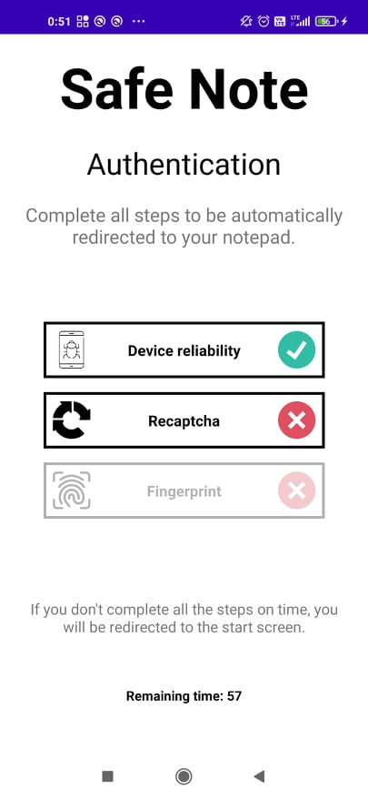

# Information about the project

#### Project name: Safe Note
#### Technologies: Kotlin
#### Creation time: Fifth semester of computer science studies
#### Purpose of creation: security of mobile systems classes
#### Author(s): Kajetan Gałęziowski 

# Preview and description

## Preview:





## Description:

#### Architecture: Model - View - ViewModel

#### Hashing function: Bcrypt
- salted by default
- the salt space is large enough to mitigate precomputation attacks, such as rainbow tables
- it has an adaptable cost.

#### KeyStore:
- setBlockModes(KeyProperties.BLOCK_MODE_GCM) cipher mode GCM
- setEncryptionPaddings(KeyProperties.ENCRYPTION_PADDING_NONE) no padding
- setKeySize(256)
- setUserAuthenticationRequired(true)
- setUserAuthenticationValidityDurationSeconds(60)
- setIsStrongBoxBacked(true) - usage TEE is available (secured hardware)
- setUnlockedDeviceRequired(true)

#### Implemented security:
- password hashed by Bcrypt (used kotlin implementation https://github.com/patrickfav/bcrypt) and stored in SharedPreferences
- note encrypted with AES with usage of KeyStore key and stores in EncryptedSharedPreferences
- verification whether device is rooted or not (used koltin implementation https://github.com/scottyab/rootbeer)
- checking access to device by system password prompt (including biometric)
- recaptcha verifcation
- limited time for authorization (timeout to main screen if count down finishes)
- app is not allowed to work in background (minimazing app = getting app closed)
- app is straight forward which means that you can't go back (back press = redirection to main screen)
- all data is fully encrypted/hashed in sharedPreferences, no plainText
- strong password required to use application with verification of it's strength
- manual protection - you need to know how to display message in note screen

#### Shared Preferences example content:

```
<?xml version='1.0' encoding='utf-8' standalone='yes' ?>
<map>
    <string name="__androidx_security_crypto_encrypted_prefs_key_keyset__">12a901d2b0be375c392f71da296184fa2c12b5df54443239ce514d5571c319bc775c480e0800772e6bb998eb4d68db5bab001c0332111ebcee1bb8da47caee0972e9532847ad1c33f4d64a140c8503b3d467fbb206d134722f7a833a85a38930b59cd7a68ac111ab7a842c6fd392ea1160bb482b790d0fe40a265844986414a7a847182b58dc9c0f729118fc4c8f58d8a99fbb7dc3f319b6a625e76df396a92ba6e9d2deca6ea131cc6687b91a4408a8b0ad8e03123c0a30747970652e676f6f676c65617069732e636f6d2f676f6f676c652e63727970746f2e74696e6b2e4165735369764b6579100118a8b0ad8e032001</string>
    <string name="ATHLWChHFUmx2HuRpO8iiDt9dr7fH8+C604o5mqBE2h4rcdeRELN">AVuS7HdgpDYLNg0AYIBtKOYaOSitmPWv3MlD4j3FCFoN80w4LIBE3GQ=</string>
    <string name="__androidx_security_crypto_encrypted_prefs_value_keyset__">128801b0a2bd2925640cb873a0a56bd4a82c6f84e2801e8f98c7e22f991274a4908ed72d916b1dae61f78169f4732dacfba7f2636c5beb094ef94fe2cd2e8389914319fd0e24d1432c3bcdad0169eb4862fce9bbe0dd122299cba8c563cde1dbf369163cb85f88af31465c18ea9a4c2e2fcd82c472058733b5edd033f5402c57bfaa1112bafe316c9c3dd01a4408f7d8cbdc05123c0a30747970652e676f6f676c65617069732e636f6d2f676f6f676c652e63727970746f2e74696e6b2e41657347636d4b6579100118f7d8cbdc052001</string>
    <string name="$2a$08$78LX1DgBmK7JZYhO.1byKOCRiFyk1.CT4Jwk16x1leh0uFjpLVC9e">$2a$14$2Z4Wc0exOFS82Wsq4fr6oOqe.E7R6rXrSC5V9bFzsjXvzIY.Kr9CO</string>
</map>
```
